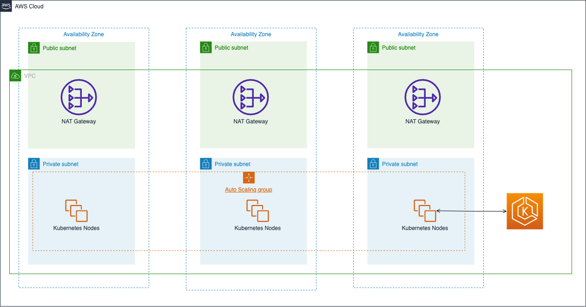

# DevOps Assessment exercise

Your mission - Should you choose to accept it - Is to complete the following tasks and open a pull request with the solution to this repo
This exercise is designed to assess your ability to learn new abilities and debug existing code at the same time
  
You are provided with:  
- Partially implemented Terraform script containing a module
- Architecture diagram - [EKS Architecture - Diagram A](#diagram-a) below

###### Diagram A
You are required to create the following architecture in Terraform

## Goal - Build Terraform Code
**Note:** Ensure that all resources created by Terraform will have the same tags or set of tags which you believe should be required  
  
**Tasks:**
- [ ] Fix Terraform
- [ ] Add **Terraform S3 Backend** for state.
- [ ] VPC with **3 private subnets** and **3 public subnets**
- [ ] VPC **should be spanned 3 availability zones**
- [ ] EKS **nodes will run only on private subnets** and on all AZs  
    **Important:** **Access to EKS API should be public** [doc](https://docs.aws.amazon.com/eks/latest/userguide/cluster-endpoint.html) to be able to run kubectl commands from your OS.
- [ ] **Multiple node groups for the cluster**
  - 1 **node group** will be called **small-nodes** - and will be **t3.micro nodes**
  - 1 **node group** will be called **large-nodes** - and will be **t3.small nodes**
  - both node groups will have 3 nodes - 1 Node per AZ
- [ ] **Helm chart** that will deploy an image called `tutum/hello-world` and expose port 80 as a load balancer.  
    Use Terraform built-in capability to run Helm charts to deploy the chart

### Additional requirements and notices

- Instructions on how to access the cluster should be provided
- The helm chart will need to be in the root of the Git repo and the Terraform module should be able to call it
- Add a correct _.gitignore_ file, so you won't commit the state files

### Tips
The existing Terraform code uses well documented **Terraform modules**
* VPC: https://registry.terraform.io/modules/terraform-aws-modules/vpc/aws/latest
* EKS: https://registry.terraform.io/modules/terraform-aws-modules/eks/aws/17.24.0

**If you need any clarifications don't hesitate to contact the person who gave you the assignment**

 

### Bonus Tasks
All bonus tasks are modular.  
   
##### Bonus 1: One EKS node group runs spot instances

Convert one of the EKS node groups to run spot instances.  
  

##### Bonus 2: Ingress Controller

Add ingress controller and add hello-world ingress to the deployed service   
     
  
##### Bonus 3: Add Bastions 

Create an autoscaling group which will launch a bastion host as in the [Diagram B](#diagram-b)  
  

###### Diagram B

